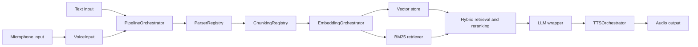

# Architecture

## Overview

This repository implements a modular, local-first retrieval-augmented generation pipeline. The main runtime path is coordinated from [src/pipeline.py](src/pipeline.py), where `PipelineOrchestrator` ties together parsing, chunking, embedding, retrieval, language generation, voice input, and text-to-speech output.

The design is intentionally staged so each subsystem can be replaced or improved without rewriting the whole stack. The public data contracts are small, typed, and stable: parsers emit `Document`, chunkers emit `Chunk`, retrieval emits `SearchResult`, and the pipeline returns structured `PipelineResult` objects.

## Runtime Flow

The current flow is:

1. Accept a text query or capture voice input.
2. If source files are provided, parse them into normalized `Document` instances.
3. Chunk each document with a global or per-format strategy.
4. Embed chunks and index them in the configured vector store.
5. Retrieve relevant chunks using dense, hybrid, and optional reranking logic.
6. Format the retrieved context into a grounded prompt.
7. Generate a response with the configured LLM provider.
8. Optionally synthesize the response with the selected TTS engine.

## Module Boundaries

### Configuration

The configuration layer lives in [src/config/settings.py](src/config/settings.py) and [src/config/loader.py](src/config/loader.py). `AppConfig` is the root model, and the nested sections control voice, chunking, embedding, retrieval, LLM, TTS, agent, and UI behavior.

The key design principle is config-first behavior. The UI, pipeline, and backends should read from typed configuration rather than carrying their own copy of defaults.

### Models

`Document` in [src/models/document.py](src/models/document.py) represents normalized source content plus metadata. `Chunk` in [src/models/chunk.py](src/models/chunk.py) represents one split segment of a document and keeps the source document attached for traceability.

These classes are frozen dataclasses, which makes them safe to pass through the pipeline and easy to serialize for logging or UI display.

### Parsing

Parsing is coordinated by [src/parsers/registry.py](src/parsers/registry.py). The registry resolves file extensions to concrete parsers and falls back to text parsing when needed. This keeps format-specific logic in one place and prevents the rest of the system from caring about file type differences.

The parser layer is responsible for normalization only. It should preserve source metadata such as filename, source type, headings, page numbers, rows, or structure hints when available.

### Chunking

Chunking is coordinated by [src/chunkers/registry.py](src/chunkers/registry.py). The registry chooses the appropriate strategy for the document type and merges any per-format override from the config.

The current chunking design covers both general and format-specific strategies:

- general strategies for line, character, and paragraph splitting
- structure-aware strategies for headings, rows, slides, chapters, tags, arrays, semantic breaks, and tokens

That split is what lets the system preserve structure for spreadsheets, JSON, and document hierarchies instead of flattening everything into raw text.

### Embeddings and Retrieval

The retrieval stack lives in [src/embeddings/orchestrator.py](src/embeddings/orchestrator.py), [src/embeddings/embedder.py](src/embeddings/embedder.py), [src/embeddings/retriever.py](src/embeddings/retriever.py), and [src/embeddings/vectorstore.py](src/embeddings/vectorstore.py).

`EmbeddingOrchestrator` owns:

- the embedding backend
- the vector store
- the dense retriever
- the BM25 retriever
- the hybrid ranker
- the optional cross-encoder reranker

This is the main relevance-control boundary in the application. Retrieval behavior should be changed by config where possible, not by special-casing logic in the UI or pipeline.

### LLM Layer

LLM prompt formatting lives in [src/llm/prompting.py](src/llm/prompting.py). Provider wrappers live in [src/llm/groq_wrapper.py](src/llm/groq_wrapper.py) and [src/llm/ollama_wrapper.py](src/llm/ollama_wrapper.py).

The prompt helper builds a grounded prompt with a clearly separated context block and question block. The provider wrappers are intentionally thin translation layers between the internal response format and each provider's HTTP or SDK interface.

### Voice Input

Voice capture is composed in [src/voice/voice_input.py](src/voice/voice_input.py) from `MicrophoneCapture`, `SileroVAD`, and `FasterWhisperSTT`. That decomposition keeps recording, speech detection, and transcription independently testable.

### Text to Speech

TTS orchestration lives in [src/tts/orchestrator.py](src/tts/orchestrator.py) with concrete engines in [src/tts/pyttsx3_tts.py](src/tts/pyttsx3_tts.py), [src/tts/gtts_tts.py](src/tts/gtts_tts.py), and [src/tts/kokoro_tts.py](src/tts/kokoro_tts.py).

The orchestrator selects a primary backend from config and falls back to the remaining engines when the configured one is unavailable or fails.

### UI

The Gradio application in [src/ui/gradio_app.py](src/ui/gradio_app.py) is a presentation layer. It should not own business logic that already exists in the pipeline, registry, or backend modules.

## Operational Notes

- Metadata must survive each transformation stage so the UI can show provenance.
- Optional dependencies should fail gracefully and preserve the ability to run the rest of the app.
- The pipeline should remain deterministic enough for unit and integration tests to verify each stage independently.
- The architecture favors small, composable objects over a single large controller.

## Why This Structure Works

This layout keeps the application maintainable as more formats, retrieval strategies, and UI controls are added. New behavior can usually be introduced by extending a registry, adding a backend, or updating configuration models. That avoids tight coupling and makes the codebase practical for phased growth.
